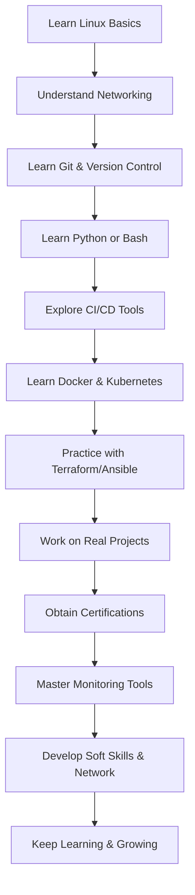

# **DevOps Roadmap: A Step-by-Step Guide for Beginners to Become a DevOps Engineer**

The world of technology demands faster software delivery, reliable infrastructure, and collaborative workflows—and **DevOps** sits at the intersection of these needs. Whether you're an aspiring DevOps engineer or just getting started, this roadmap will guide you through a structured learning path with actionable steps to help you embark on your journey.

---

## **1. Introduction to DevOps**

**What is DevOps?**  
DevOps is a **cultural and technical movement** that promotes **collaboration** between software developers and operations teams. The goal is to **automate** processes, create **continuous delivery pipelines**, and monitor software effectively.  

**Core Principles of DevOps:**  
- **Collaboration:** Seamless communication between development and operations.  
- **Automation:** Automate workflows to reduce human error and increase speed.  
- **CI/CD:** Implement Continuous Integration (CI) and Continuous Delivery (CD) for faster, more reliable releases.  
- **Monitoring:** Ensure applications are healthy using performance tracking and alerting systems.

**Why DevOps is in Demand:**  
Companies need skilled DevOps engineers to streamline development, reduce downtime, and ensure a better user experience. As businesses transition to cloud infrastructure, DevOps engineers are **highly sought-after**, making it one of the most promising career paths in tech today.

---

## **2. Learning Path Overview**  

To become a proficient DevOps engineer, you’ll need to acquire both **foundational skills** and expertise in **specialized tools**. Below is a breakdown of key stages and their estimated learning timelines.  

### **Key Stages & Estimated Timelines:**
- **Foundational Skills:** 1-2 months  
- **Learning DevOps Tools:** 3-4 months  
- **Practical Projects:** Ongoing  
- **Monitoring and Certifications:** 2-3 months  
- **Continuous Learning:** Lifetime

---

## **3. Foundational Skills** (1-2 Months)  

### 1. **Linux/Unix Fundamentals:**  
- Learn **basic Linux commands** (e.g., `ls`, `cd`, `grep`, `chmod`) as most DevOps tools run on Linux systems.  
- Set up a virtual machine (VM) or use cloud platforms to practice.  
- Suggested Resources:  
  - [Linux Survival Guide](https://linuxsurvival.com/)  
  - FreeCodeCamp’s YouTube tutorials  

### 2. **Networking Basics:**  
Understand **IP addressing, DNS, HTTP, firewalls, and load balancers**. This knowledge will help you troubleshoot infrastructure issues effectively.

### 3. **Version Control (Git):**  
Git is a must-know tool for tracking code changes and collaborating with developers.  
- Learn Git basics: `clone`, `commit`, `branch`, `push`, `merge`.  
- Hands-on: Create a GitHub account and host a personal project.  
- Resource: [Git Documentation](https://git-scm.com/doc)

### 4. **Programming and Scripting:**  
Familiarity with a programming or scripting language is essential.  
- **Bash:** For scripting and automation on Unix systems.  
- **Python:** For building tools, automation, and interacting with APIs.  
- Suggested Course: Codecademy’s **Learn Python**.

---

## **4. DevOps Tools and Practices** (3-4 Months)  

### 1. **Continuous Integration/Delivery (CI/CD):**  
- **Jenkins:** Automate builds and tests.  
- **GitHub Actions / GitLab CI:** Automate workflows directly from repositories.  
- **Practice:** Set up a basic CI/CD pipeline to automate code testing and deployment.  

### 2. **Containerization and Orchestration:**  
- **Docker:** Learn how to containerize applications to ensure consistency across environments.  
  - Practice: Deploy a simple Node.js app using Docker.  
- **Kubernetes:** Manage containers in production, ensuring **scalability** and **high availability**.  
  - Practice: Deploy your Docker container to a Kubernetes cluster using **Minikube** or **K3D**.  

### 3. **Infrastructure as Code (IaC):**  
- **Terraform:** Automate infrastructure setup using code.  
- **Ansible:** Manage configuration files and automate system tasks.  
  - Practice: Write a Terraform script to deploy a virtual machine in AWS.

---

## **5. Practical Projects and Certifications** (Ongoing)  

### **Project Ideas:**  
- **Set up a CI/CD pipeline:** Use Jenkins or GitHub Actions to automate builds and tests.  
- **Container Deployment:** Containerize a web app using Docker and deploy it on Kubernetes.  
- **IaC Practice:** Use Terraform to provision cloud infrastructure on AWS or Azure.  

### **Certifications to Consider:**  
- **AWS Certified DevOps Engineer – Professional**  
- **Microsoft Certified: DevOps Engineer Expert**  
- **Docker Certified Associate**  
Certifications validate your skills and can make you stand out in the job market.

---

## **6. Monitoring and Logging** (2-3 Months)  

Monitoring helps ensure applications are performing well and are free from issues.  

- **Prometheus & Grafana:** Collect metrics and visualize system health.  
- **ELK Stack (Elasticsearch, Logstash, Kibana):** Centralized logging and troubleshooting.  
- **Practice:** Set up Prometheus and Grafana to monitor a web server.

---

## **7. Soft Skills and Continuous Learning**  

Being a DevOps engineer isn't just about technical expertise—you also need **soft skills** and the ability to adapt to evolving technologies.  

### **Key Soft Skills:**  
- **Collaboration:** Work closely with development, operations, and QA teams.  
- **Communication:** Clearly explain technical issues and processes to non-technical stakeholders.  
- **Problem-Solving:** Quickly identify and fix infrastructure or software problems.

### **Continuous Learning:**  
- **Books:** “The Phoenix Project” by Gene Kim, “The DevOps Handbook” by Jez Humble.  
- **Communities:** Join online forums like DevOps Subreddit or attend meetups.  
- **Courses:** Platforms like Coursera, Udemy, and LinkedIn Learning offer up-to-date DevOps courses.

---

## **8. Visual DevOps Roadmap**

Below is a simple **visual roadmap** to give you an overview of the journey from beginner to DevOps engineer.

---

## **Conclusion**

Becoming a DevOps engineer requires mastering a mix of **technical skills, tools, and best practices**. The journey may seem daunting, but by following this roadmap step-by-step—starting with Linux, Git, and programming, and progressing through CI/CD, Docker, and Kubernetes—you’ll build the knowledge and confidence needed to succeed.

Working on **projects** and earning **certifications** will give you hands-on experience, while continuous learning will ensure you stay updated with the latest trends in DevOps. Remember, DevOps is more than a set of tools—it’s a mindset that encourages collaboration, automation, and continuous improvement.

The world of DevOps awaits—start your journey today!
